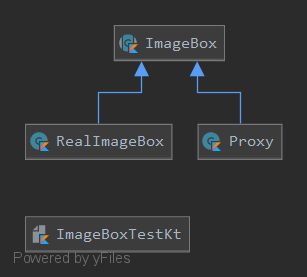

# Паттерн заместитель (Proxy).
Proxy является суррогатом другого объекта и управляет доступом к нему.

Используется, если:
* нужно управлять ресурсоемкими объектами
* вы не хотите создавать экземпляры таких объектов до момента их реального использования 

_Задание:_

Cоздать простейшую модель фрагмента графического редактора, позволяющую нарисовать на экране монитора бокс, имеющий размеры реального изображения, хранящегося на диске под именем img.
* Используя паттерн «proxy» обеспечить свободное перемещение бокса с помощью «мыши» по экрану.
* При двойном нажатии на правую клавишу «мыши» обеспечить загрузку реального изображения в нарисованный бокс. 

_Решение:_

# Тесты
 [Тест](ImageBoxTest.kt)
