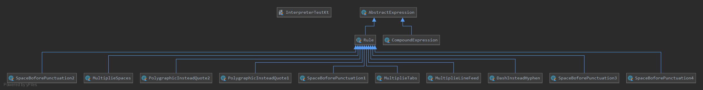

## Паттерн Interpreter (интерпетатор).
* Для заданного языка определяет представление его грамматики и интерпретатор предложений этого языка.
* Отображает проблемную область в язык, язык – в грамматику, а грамматику – в иерархии объектно-ориентированного проектирования.

_Задание:_

Cоздать простейший интерпретатор текстового редактора, позволяющий исправлять стандартные ошибки, допускаемые при подготовке обычных текстов. 

Типичные структурные ошибки:

    1. Множественные пробелы
    2. Использование дефиса вместо тире
    3. Использование в качестве кавычек символов “”, тогда как стандартом является использование «»
    4. Неправильное использование табуляторов
    5. Наличие «лишнего» пробела после открывающей скобки, перед закрывающей скобкой, перед запятой, перед точкой
    6. Наличие множественных символов перевода строки
    
Разработать грамматику и иерархию классов. Провести синтаксический анализ текста и устранить перечисленные ошибки. 

_Решение:_

##  Тесты
[Тест](InterpreterTest.kt)
