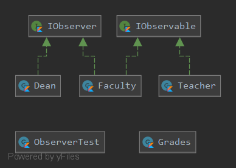

## Паттерн Observer (наблюдатель).
Имеется система, состоящая из множества взаимодействующих классов.
При этом взаимодействующие объекты должны находиться в согласованных состояниях.
Вы хотите избежать монолитности такой системы, сделав классы слабо связанными (или повторно используемыми).

_Задание:_

Деканат отслеживает текущую успеваемомсть в группах факультета по одной из дисциплин.
1. Пеподаватели раз в неделю создают текущую успеваемость и размещают ее в базе данных.
2. Если преподаватель вовремя не создал текущую успеваемость – деканат оповещает об этом кафедру. 

_Решение:_

## Тесты
[Тест](ObserverTest.kt)
